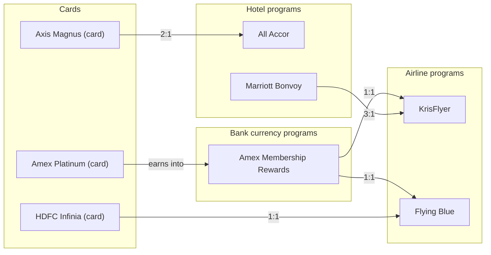

# Points Transfer Calculator — Clone Blueprint (Flutter, Mobile + Web)

## 1. What the tool actually does (functional analysis)

PointsCasa's Transfer Calculator is a **graph lookup + ratio-math tool** over a curated dataset. Breaking down what's on the page:

**Core interaction**
- Two picker fields: **Transfer From** (credit cards *and* bank point currencies, e.g. "Amex Platinum", "Axis Magnus", "HDFC Infinia") and **Transfer To** (airline & hotel loyalty programs, e.g. KrisFlyer, Marriott Bonvoy, Flying Blue).
- A **swap button** to flip From/To.
- A numeric **points input** ("Transfer Points") that drives a live-recalculated output value.
- Both pickers are searchable, logo-driven dropdowns ("Any program..." default, then a scrollable list with images).

**Results**
- A **"Transfer To Options"** list and a **"Transfer From Options"** list — i.e., given one side fixed, show all valid partners on the other side, each with its computed value.
- Each result row implicitly carries: transfer ratio, whether it's a **Direct** partner vs requires an intermediate hop, and whether a **Bonus** (time-limited transfer bonus, e.g. +25%) is currently active.
- **Filters**: "Show Bonus Only", "Show Direct Only", **Sort by Value**, filter by **Type** (airline/hotel/bank) and **Brand** (issuer/alliance), with a result count and "Clear all".
- A live **"⚡ N Bonus Offers"** counter/banner — global count of active transfer bonuses, clickable to auto-fill a card that currently has a bonus.

**Supporting content (SEO/growth layer, not core app logic)**
- Auto-generated **guide pages**: `/tools/transfers/from-{card}/`, `/tools/transfers/to-{program}/`, `/tools/transfers/{card}-to-{program}/` — these are just filtered/pre-rendered views of the same underlying graph, one per card, one per program, one per edge.
- **Account layer**: login to save balances, a "Saved" balances panel, sign-up upsell modal (track balances, search award availability, get transfer recommendations).

**The essential abstraction**: this is a **directed graph** where nodes are "point currencies" (a credit card's rewards currency, or a standalone bank currency, or an airline/hotel program) and edges are "transfer relationships" carrying a ratio, min/max limits, and optional time-boxed bonus. The calculator is just: pick a node → walk its outgoing (or incoming) edges → apply ratio + active bonus → sort/filter → render.

---

## 2. Feature list to build (MVP → full parity)

| Priority | Feature |
|---|---|
| P0 | Program/card directory with logos, searchable picker |
| P0 | From→To and To→From graph lookup with live ratio math |
| P0 | Points input with instant recalculation |
| P0 | Swap From/To |
| P0 | Result list with sort (value desc/asc), filters (direct only, bonus only, type, brand) |
| P0 | Responsive layout: mobile bottom-sheet pickers, web side-by-side pickers |
| P1 | Active bonus badges + "N Bonus Offers" global banner, tap-to-autofill |
| P1 | Auth (email/OAuth), saved point balances per program |
| P1 | Deep links / shareable URLs (`?from=x&to=y&value=10000`) for web SEO & sharing |
| P1 | Static guide pages generated from the same data (from-card, to-program, card-to-program) |
| P2 | Multi-hop transfer paths (find the best route across 2–3 edges, not just the direct one — see Section 10) |
| P2 | Admin/CMS to maintain programs, cards, ratios, bonuses without redeploying |
| P2 | Push notifications for new bonuses on a user's saved cards |

---

## 3. System architecture

```
┌─────────────────────────────┐        ┌──────────────────────────┐
│   Flutter App (mobile+web)  │  REST  │      Backend API         │
│  - Presentation (widgets)   │◄──────►│  (Node/NestJS or Django)  │
│  - State (Riverpod)         │  JSON  │  - Auth (JWT)             │
│  - Domain (use cases)       │        │  - Programs/Cards/Edges   │
│  - Data (repositories)      │        │  - Bonus offers cron      │
└─────────────┬────────────────┘        └────────────┬─────────────┘
              │ local cache (Isar/Hive)               │
              ▼                                       ▼
     Offline snapshot of graph                 PostgreSQL (graph schema)
```

**Why this split:** the transfer graph changes slowly (banks update ratios monthly at most) but is read constantly. Ship it as a **versioned JSON snapshot** the app caches locally (Isar/Hive/SQLite), refreshed on launch via an ETag/`updated_at` check. All ratio math runs **on-device** — instant, no network round-trip per keystroke. The backend's job is: serve the graph, handle auth, handle user balances/favorites, and run the bonus-offer scheduler.

**Recommended stack**
- **Flutter**: 3.x, `go_router` for URL-based routing (critical for web deep links + SEO), `riverpod` (or `bloc` if your team prefers it) for state, `flutter_hooks` optional.
- **Local persistence**: `Isar` (fast, works on mobile+web+desktop) or `drift` (SQLite, if you want the local cache to literally mirror the relational schema below).
- **Backend**: Postgres + a thin API layer (NestJS/Express or Django REST Framework) — Postgres because the domain is inherently relational/graph-like (foreign keys, joins for filters).
- **Alternative low-ops path**: Supabase (Postgres + auto REST/GraphQL + Auth) — gets you 80% of the backend for free and maps 1:1 onto the schema in Section 5.
- **Hosting**: Flutter web build → Cloudflare Pages/Firebase Hosting; API → Fly.io/Render/Railway; DB → Supabase/RDS.

---

## 4. Step-by-step build plan

### Phase 0 — Data modeling & seed data (do this first, everything depends on it)
1. Enumerate every node: each credit card, each bank's own currency (if distinct from any single card), each airline program, each hotel program, each alliance.
2. Enumerate every edge: for each node, its outgoing transfer partners, ratio, min/max, fee, direct vs. requires-enrollment, and current bonus (if any).
3. Model this as the graph schema in Section 5. Load it into Postgres via a seed script (CSV → SQL import is fine for v1).
4. Write one validation script that checks: no orphan edges, no duplicate (from,to) active edges, ratios > 0.

### Phase 1 — Backend API
5. Stand up Postgres with the schema below (migrations via Prisma/TypeORM/Django ORM).
6. Build endpoints:
   - `GET /nodes?type=card|program&search=` — directory/search for pickers.
   - `GET /nodes/:id/edges?direction=outgoing|incoming` — the calculator's core query.
   - `GET /graph/snapshot?since=` — full/delta dump for the app's local cache.
   - `GET /bonuses/active` — for the "N Bonus Offers" banner.
   - `POST /auth/*`, `GET/POST /me/balances`, `GET/POST /me/favorites`.
7. Add response caching (Redis or in-memory) — this data barely changes; cache aggressively, invalidate on admin write.

### Phase 2 — Flutter project skeleton
8. `flutter create --platforms=android,ios,web pointscasa_clone`.
9. Folder structure (clean architecture):
   ```
   lib/
     core/            # theming, constants, utils, router
     data/
       models/        # NodeModel, EdgeModel, BonusModel (freezed + json_serializable)
       datasources/    # remote (dio) + local (isar) sources
       repositories/    # repository implementations
     domain/
       entities/
       repositories/    # abstract interfaces
       usecases/        # GetTransferOptions, SearchNodes, ComputeValue
     presentation/
       calculator/       # main screen, picker sheet, result list, filters
       program_detail/
       auth/
       balances/
       guides/            # static-style pages for from/to/route
       widgets/           # shared: NodeAvatar, RatioBadge, BonusChip
   ```
10. Set up `go_router` with routes mirroring the SEO URL structure:
    `/`, `/transfers/from-:cardSlug`, `/transfers/to-:programSlug`, `/transfers/:fromSlug-to-:toSlug`, `/calculator?from=&to=&value=`.
11. Wire dependency injection (riverpod providers) for repositories/use-cases.

### Phase 3 — Core calculator UI
12. Build `NodePickerSheet`: bottom sheet on mobile, popover/dropdown on web, with search box, grouped list (Cards / Bank currencies / Airlines / Hotels), logo + name rows, and an "Any program..." default state.
13. Build the calculator screen: From field, swap icon button, To field, points `TextField` (numeric, formatted with thousands separators via `flutter/services` `TextInputFormatter`).
14. On any change (from/to/value), call `GetTransferOptions` use case:
    - If both From and To are set → single computed value + a small breakdown (ratio, bonus %, fee).
    - If only From is set → list all outgoing edges from that node (the "Transfer To Options" list).
    - If only To is set → list all incoming edges to that node (the "Transfer From Options" list).
15. Result row widget: logo, name, computed value, `RatioBadge` ("2 : 1"), `BonusChip` if active, "Direct" vs "Via transfer partner" tag, and an optional cap/min badge (e.g. "⚠️ 5k cap") from `capBadgeFor()` (Section 10.6) — this badge is informational only and never changes the displayed computed value, matching real product behavior where hitting a cap just means multiple manual transfers, not a smaller payout.
16. Filter bar: toggle chips (Bonus only / Direct only), `Sort by` dropdown, `Type` and `Brand` multi-select filters — implement as pure client-side filtering over the cached edge list (instant, no network).
17. Empty/error states ("No results found — try adjusting your search or filter").

### Phase 4 — Calculation engine
18. Pure Dart function for a single edge, fully unit-testable, no widget dependencies:
    ```dart
    double computeTransferValue({
      required num points,
      required Edge edge,
      BonusOffer? activeBonus,
    }) {
      final baseRatio = edge.ratioTo / edge.ratioFrom;
      final bonusMultiplier = (activeBonus != null && activeBonus.isActiveNow)
          ? 1 + (activeBonus.bonusPercent / 100)
          : 1.0;
      return points * baseRatio * bonusMultiplier;
    }
    ```
19. **Multi-hop pathfinding is not optional for correctness** — see Section 10. A direct edge is not always the best value; the same points can sometimes be routed through 1–2 intermediate programs for a materially higher payout (classic example: a card that transfers to Finnair 1:1, which combines to BA Avios 1:1, which transfers to Qatar 1:1, beats a direct 2:1 card→Qatar edge). Build `findBestPaths()` (Section 10) alongside the single-edge function above, and always show the user the best of {direct value, best multi-hop value} side by side rather than only the direct one.

### Phase 5 — Responsive layout
20. Use `LayoutBuilder`/`MediaQuery` breakpoints (e.g. <600 mobile, 600–1024 tablet, >1024 web/desktop): stacked single-column on mobile, two-column From/To side-by-side with a results panel on web.
21. Ensure the picker works with both touch (bottom sheet) and mouse/keyboard (searchable dropdown with arrow-key navigation) — Flutter web should not just reuse mobile touch targets verbatim.

### Phase 6 — Auth, balances, favorites
22. Email/password + Google/Apple sign-in (`firebase_auth` or custom JWT + `flutter_secure_storage`).
23. "Saved" balances screen: user enters current point balance per program; calculator can then show "your balance is worth ~X".
24. Favorites/pinned routes.

### Phase 7 — SEO-critical guide pages (web only concern)
25. Flutter web renders client-side by default, which hurts SEO for the guide pages. Options, in order of recommendation:
    - Best: generate the guide pages (`from-card`, `to-program`, `card-to-program`) as a **separate static site** (Next.js/Astro) that reads the same API, and keep the interactive calculator as the Flutter web app embedded/linked from it.
    - Acceptable: use Flutter web with `flutter_seo`-style prerendering or a headless-Chrome prerender service (e.g. Rendertron) in front of it, plus `go_router` deep links so each guide has a real URL.
26. Whichever route, keep the data layer identical — guides are just filtered views of the same `edges` table.

### Phase 8 — Testing, monitoring, launch
27. Unit tests: calculation engine, filters, sorting. Widget tests: picker, result list. Integration tests: full from→to→value flow.
28. Analytics: track picker selections, filter usage, bonus-click-through (drives what to prioritize next).
29. CI/CD: GitHub Actions → build web (Cloudflare Pages) + Android/iOS (Fastlane) on tag push.
30. Soft launch → gather which routes/cards users search for but don't find → prioritize data-entry backlog.

---

## 5. Database schema

### Design rationale
The domain is a **directed graph**: nodes = "things that hold points" (a card's rewards currency, a standalone bank currency, an airline program, a hotel program); edges = "you can transfer from node A to node B at ratio R, optionally with min/max limits and a time-boxed bonus." Modeling it this way (rather than a rigid `cards→programs` and separate `programs→programs` table) means:
- One `edges` table naturally answers card→program, program→program, *and* card→card, without duplicated logic.
- Filters (Direct/Bonus/Type/Brand) all become `WHERE`/`JOIN` clauses on the same two tables.
- Guide pages (`from-x`, `to-y`, `x-to-y`) are just parameterized queries against `edges`.

### Entity list
- `issuers` — banks/companies that issue cards (Amex, HDFC, Axis...)
- `alliances` — Star Alliance / OneWorld / SkyTeam (optional grouping for airline programs)
- `nodes` — supertype row for every transferable point currency
- `cards` — subtype detail for nodes of type `card`
- `programs` — subtype detail for nodes of type `program` (airline/hotel/bank_currency/other)
- `transfer_edges` — the graph edges: ratio, limits, direct flag
- `bonus_offers` — time-boxed bonus attached to an edge
- `computed_routes` — precomputed best multi-hop paths per (from, to) pair (Section 10)
- `users`, `user_balances`, `user_favorites` — account layer

### SQL DDL

```sql
-- ── Reference tables ─────────────────────────────────────────
CREATE TABLE issuers (
    id            BIGSERIAL PRIMARY KEY,
    name          TEXT NOT NULL,
    country       TEXT,
    logo_url      TEXT,
    created_at    TIMESTAMPTZ DEFAULT now()
);

CREATE TABLE alliances (
    id            BIGSERIAL PRIMARY KEY,
    name          TEXT NOT NULL UNIQUE  -- Star Alliance, OneWorld, SkyTeam
);

-- ── Graph supertype ─────────────────────────────────────────
CREATE TYPE node_type AS ENUM ('card', 'program');

CREATE TABLE nodes (
    id            BIGSERIAL PRIMARY KEY,
    node_type     node_type NOT NULL,
    name          TEXT NOT NULL,
    slug          TEXT NOT NULL UNIQUE,
    logo_url      TEXT,
    created_at    TIMESTAMPTZ DEFAULT now(),
    updated_at    TIMESTAMPTZ DEFAULT now()
);
CREATE INDEX idx_nodes_type ON nodes(node_type);
CREATE INDEX idx_nodes_search ON nodes USING GIN (to_tsvector('english', name));

-- ── Card subtype ─────────────────────────────────────────────
CREATE TABLE cards (
    node_id           BIGINT PRIMARY KEY REFERENCES nodes(id) ON DELETE CASCADE,
    issuer_id         BIGINT NOT NULL REFERENCES issuers(id),
    network           TEXT,              -- Visa / Mastercard / Amex / Diners / RuPay
    annual_fee_amount NUMERIC(12,2),
    annual_fee_currency TEXT DEFAULT 'INR',
    card_tier         TEXT,              -- e.g. 'super-premium', 'mid-tier'
    region            TEXT DEFAULT 'IN',
    -- if a card earns into a shared bank-currency program instead of being its own
    -- transferable currency, point at that program node; NULL if the card node itself
    -- is the currency (rare 1:1 case).
    earns_into_node_id BIGINT REFERENCES nodes(id)
);

-- ── Program subtype ──────────────────────────────────────────
CREATE TYPE program_type AS ENUM ('airline', 'hotel', 'bank_currency', 'other');

CREATE TABLE programs (
    node_id       BIGINT PRIMARY KEY REFERENCES nodes(id) ON DELETE CASCADE,
    program_type  program_type NOT NULL,
    alliance_id   BIGINT REFERENCES alliances(id),
    country       TEXT,
    website        TEXT
);

-- ── Edges: the transfer graph ────────────────────────────────
CREATE TABLE transfer_edges (
    id                 BIGSERIAL PRIMARY KEY,
    from_node_id       BIGINT NOT NULL REFERENCES nodes(id),
    to_node_id         BIGINT NOT NULL REFERENCES nodes(id),
    ratio_from         NUMERIC(10,4) NOT NULL DEFAULT 1,  -- "2" in a 2:1 ratio
    ratio_to           NUMERIC(10,4) NOT NULL DEFAULT 1,  -- "1" in a 2:1 ratio
    is_direct          BOOLEAN NOT NULL DEFAULT TRUE,     -- FALSE = requires enrollment/hop
    -- DISPLAY-ONLY. Per-transaction limits shown to the user as a UI badge
    -- (e.g. "5k cap", "min 1k") — see Section 10.6. They do NOT reduce the
    -- calculated value: a user hitting a cap just submits multiple transfer
    -- transactions to move their full balance, so the final points math
    -- always uses the user's full input amount regardless of these limits.
    min_transfer       INTEGER,
    max_transfer       INTEGER,
    -- the window max_transfer actually applies over — many real caps are not
    -- "per transaction" but "per calendar period" (e.g. "5,000 points per
    -- quarter" is a very different constraint than "5,000 points per
    -- transfer"). Still display-only, same as max_transfer itself — see 10.6.
    max_transfer_period TEXT DEFAULT 'per_transfer',
        -- 'per_transfer' | 'daily' | 'monthly' | 'quarterly' | 'yearly'
    transfer_increment INTEGER DEFAULT 1,
    transfer_fee       NUMERIC(12,2) DEFAULT 0,
    fee_currency       TEXT,
    source_url         TEXT,
    last_verified_at   TIMESTAMPTZ,
    -- how the destination program rounds a fractional result (rarely exact,
    -- e.g. a 3:1 or 5:4 ratio) — needed for correct multi-hop math, see Section 10
    rounding_rule      TEXT DEFAULT 'floor',   -- 'floor' | 'nearest' | 'nearest_100' | 'ceil'
    -- distinguishes a genuine ratio-conversion transfer from moving the SAME
    -- underlying currency between co-branded accounts (e.g. Avios between
    -- BA / Iberia / Finnair / Qatar) — see caveat in Section 10
    edge_category      TEXT DEFAULT 'transfer', -- 'transfer' | 'pool_combine'
    created_at         TIMESTAMPTZ DEFAULT now(),
    updated_at         TIMESTAMPTZ DEFAULT now(),
    CONSTRAINT no_self_loop CHECK (from_node_id <> to_node_id),
    CONSTRAINT positive_ratio CHECK (ratio_from > 0 AND ratio_to > 0),
    UNIQUE (from_node_id, to_node_id)
);
CREATE INDEX idx_edges_from ON transfer_edges(from_node_id);
CREATE INDEX idx_edges_to   ON transfer_edges(to_node_id);

-- ── Time-boxed bonuses on an edge ────────────────────────────
CREATE TABLE bonus_offers (
    id                BIGSERIAL PRIMARY KEY,
    transfer_edge_id  BIGINT NOT NULL REFERENCES transfer_edges(id) ON DELETE CASCADE,
    bonus_percent     NUMERIC(5,2) NOT NULL,   -- e.g. 25.00 for +25%
    starts_at         TIMESTAMPTZ NOT NULL,
    ends_at           TIMESTAMPTZ NOT NULL,
    terms_url         TEXT,
    created_at        TIMESTAMPTZ DEFAULT now()
);
CREATE INDEX idx_bonus_window ON bonus_offers(starts_at, ends_at);

-- ── Precomputed multi-hop routes (see Section 10) ─────────────
-- Refreshed by a background job whenever transfer_edges or bonus_offers change.
-- Avoids running graph search on every user keystroke for common (from,to) pairs.
CREATE TABLE computed_routes (
    id              BIGSERIAL PRIMARY KEY,
    from_node_id    BIGINT NOT NULL REFERENCES nodes(id),
    to_node_id      BIGINT NOT NULL REFERENCES nodes(id),
    hop_node_ids    BIGINT[] NOT NULL,        -- ordered intermediate nodes (excludes from/to)
    edge_ids        BIGINT[] NOT NULL,        -- ordered edge_ids used, same length as hops+1
    net_ratio       NUMERIC(14,6) NOT NULL,   -- combined multiplier: output_points / input_points
    hop_count       INT NOT NULL,
    includes_active_bonus BOOLEAN DEFAULT FALSE, -- net_ratio already factors in a live bonus
    computed_at     TIMESTAMPTZ DEFAULT now(),
    UNIQUE (from_node_id, to_node_id, hop_count)
);
CREATE INDEX idx_computed_routes_lookup ON computed_routes(from_node_id, to_node_id);

-- ── Account layer ─────────────────────────────────────────────
CREATE TABLE users (
    id             BIGSERIAL PRIMARY KEY,
    email          TEXT UNIQUE NOT NULL,
    password_hash  TEXT,
    display_name   TEXT,
    created_at     TIMESTAMPTZ DEFAULT now()
);

CREATE TABLE user_balances (
    id          BIGSERIAL PRIMARY KEY,
    user_id     BIGINT NOT NULL REFERENCES users(id) ON DELETE CASCADE,
    node_id     BIGINT NOT NULL REFERENCES nodes(id),
    balance     BIGINT NOT NULL DEFAULT 0,
    updated_at  TIMESTAMPTZ DEFAULT now(),
    UNIQUE (user_id, node_id)
);

CREATE TABLE user_favorites (
    id            BIGSERIAL PRIMARY KEY,
    user_id       BIGINT NOT NULL REFERENCES users(id) ON DELETE CASCADE,
    from_node_id  BIGINT NOT NULL REFERENCES nodes(id),
    to_node_id    BIGINT NOT NULL REFERENCES nodes(id),
    created_at    TIMESTAMPTZ DEFAULT now(),
    UNIQUE (user_id, from_node_id, to_node_id)
);
```

**Example rows** to make the model concrete:

| from_node (card/program) | to_node (program) | ratio_from:ratio_to | is_direct |
|---|---|---|---|
| Amex Membership Rewards *(program, bank_currency)* | KrisFlyer *(program, airline)* | 1 : 1 | true |
| Axis Magnus *(card)* | All Accor *(program, hotel)* | 2 : 1 | true |
| HDFC Infinia *(card)* | Flying Blue *(program, airline)* | 1 : 1 | true |
| Marriott Bonvoy *(program, hotel)* | KrisFlyer *(program, airline)* | 3 : 1 | true |

Note the last row: this is exactly the "among loyalty programs themselves" relationship you asked about — Marriott (hotel) → KrisFlyer (airline) — modeled with the *same* `transfer_edges` table, because both sides are just `node_id`s regardless of whether the underlying subtype is `card` or `program`.

---

## 6. Entity-Relationship Diagram

```mermaid
erDiagram
    ISSUERS ||--o{ CARDS : issues
    ALLIANCES ||--o{ PROGRAMS : groups
    NODES ||--o| CARDS : "is-a"
    NODES ||--o| PROGRAMS : "is-a"
    NODES ||--o{ TRANSFER_EDGES : "from_node"
    NODES ||--o{ TRANSFER_EDGES : "to_node"
    TRANSFER_EDGES ||--o{ BONUS_OFFERS : "has active"
    NODES ||--o{ COMPUTED_ROUTES : "from_node"
    NODES ||--o{ COMPUTED_ROUTES : "to_node"
    USERS ||--o{ USER_BALANCES : tracks
    USERS ||--o{ USER_FAVORITES : saves
    NODES ||--o{ USER_BALANCES : "balance of"
    NODES ||--o{ USER_FAVORITES : "route endpoint"

    NODES {
        bigint id PK
        enum node_type "card | program"
        text name
        text slug
        text logo_url
    }
    CARDS {
        bigint node_id PK_FK
        bigint issuer_id FK
        text network
        numeric annual_fee_amount
        text card_tier
        bigint earns_into_node_id FK
    }
    PROGRAMS {
        bigint node_id PK_FK
        enum program_type "airline | hotel | bank_currency | other"
        bigint alliance_id FK
        text country
    }
    ISSUERS {
        bigint id PK
        text name
        text country
    }
    ALLIANCES {
        bigint id PK
        text name
    }
    TRANSFER_EDGES {
        bigint id PK
        bigint from_node_id FK
        bigint to_node_id FK
        numeric ratio_from
        numeric ratio_to
        bool is_direct
        int min_transfer
        int max_transfer
        text max_transfer_period "per_transfer | daily | monthly | quarterly | yearly"
        numeric transfer_fee
        text rounding_rule
        text edge_category "transfer | pool_combine"
    }
    COMPUTED_ROUTES {
        bigint id PK
        bigint from_node_id FK
        bigint to_node_id FK
        bigint_array hop_node_ids
        bigint_array edge_ids
        numeric net_ratio
        int hop_count
        bool includes_active_bonus
    }
    BONUS_OFFERS {
        bigint id PK
        bigint transfer_edge_id FK
        numeric bonus_percent
        timestamptz starts_at
        timestamptz ends_at
    }
    USERS {
        bigint id PK
        text email
        text display_name
    }
    USER_BALANCES {
        bigint id PK
        bigint user_id FK
        bigint node_id FK
        bigint balance
    }
    USER_FAVORITES {
        bigint id PK
        bigint user_id FK
        bigint from_node_id FK
        bigint to_node_id FK
    }
```

## 7. Graph view (how the calculator actually walks this data)



This is the picture the schema encodes: cards feed into either their own node or a shared bank-currency node, and *every* edge — card→program or program→program — lives in one `transfer_edges` table.

---

## 8. Key API contracts (for the Flutter data layer)

```
GET /api/nodes?type=card&search=axis
→ [{ id, name, slug, logoUrl, type, issuer: {...} }]

GET /api/nodes/:id/edges?direction=outgoing
→ [{
     toNode: { id, name, slug, logoUrl, type, programType },
     ratioFrom, ratioTo, isDirect,
     activeBonus: { bonusPercent, endsAt } | null,
     minTransfer, maxTransfer, maxTransferPeriod
   }]

GET /api/graph/snapshot?since=2026-07-01T00:00:00Z
→ { nodes: [...], edges: [...], deletedNodeIds: [...], deletedEdgeIds: [...] }

GET /api/bonuses/active
→ { count: 7, offers: [{ edgeId, fromNode, toNode, bonusPercent, endsAt }] }
```

The Flutter repository layer fetches `/graph/snapshot` on app start (or on a stale cache), stores it in Isar/drift, and every calculator interaction thereafter is a **pure local query + Dart computation** — no network latency on keystrokes, which is what makes the live recalculation feel instant like the original tool.

---

## 9. Suggested timeline

| Week | Milestone |
|---|---|
| 1 | Data modeling finalized, schema migrated, seed data for ~30 nodes/100 edges |
| 2 | Backend API (nodes, edges, snapshot) + Flutter skeleton + routing |
| 3 | Calculator screen (pickers, live calc, swap) on mobile |
| 4 | Filters/sort, responsive web layout, result list polish |
| 5 | Auth + balances + favorites |
| 6 | Guide pages (static or prerendered), bonus banner, analytics, QA, launch |

---

## 10. Indirect / multi-hop transfer paths

A direct edge is not always the best value. Worked example from HDFC Infinia:

```
Direct:   Infinia --2:1--> Qatar Privilege Club        → 30,000 pts = 15,000 Avios
Indirect: Infinia --1:1--> Finnair Plus                → 30,000 = 30,000 Avios
                --1:1--> BA Executive Club (pool_combine) → 30,000 Avios
                --1:1--> Qatar Privilege Club           → 30,000 Avios
```
The indirect path yields **2x** the direct one. The schema supports this structurally (edges are just `node_id → node_id`, so nothing stops chaining them), but the *query logic* needs to actively search for it — a naive "look up the direct edge" implementation will never surface it.

### 10.1 Why this isn't plain shortest-path
You're not minimizing a sum of weights — you're **maximizing a product of ratios** (subject to per-hop min/max limits, fees, and rounding). Log-transforming (`maximize ∏ratio` ≡ `minimize ∑ -log(ratio)`) turns it back into shortest-path math, but introduces negative edge weights, and — critically — if any cycle in the graph has a combined ratio > 1, a naive shortest-path algorithm could loop forever "arbitraging" points. That must be explicitly prevented (see the `visited` set below), not just assumed away.

### 10.2 Practical algorithm: bounded, simple-path DFS
For a graph this size (a few hundred nodes, most people won't want more than 2–3 hops of hassle anyway), skip Bellman-Ford and use depth-bounded DFS with no node revisits:

```dart
class TransferPath {
  final List<Edge> hops;
  final double finalValue;
  int get hopCount => hops.length;
}

List<TransferPath> findBestPaths({
  required Node from,
  required Node to,
  required num points,
  int maxHops = 3,
}) {
  final results = <TransferPath>[];

  void dfs(Node current, num currentPoints, List<Edge> path, Set<int> visited) {
    if (path.length > maxHops) return;                  // depth cap
    if (current.id == to.id && path.isNotEmpty) {
      results.add(TransferPath(hops: List.of(path), finalValue: currentPoints.toDouble()));
      return;                                            // don't extend past a match
    }
    for (final edge in outgoingEdgesOf(current)) {
      if (visited.contains(edge.toNodeId)) continue;      // simple path only — no revisits, no loops

      // min_transfer / max_transfer are DISPLAY-ONLY (see Section 10.6) — they
      // never gate or cap the math. If a user is above the cap or below the
      // minimum, that's a UI badge ("5k cap"), not a smaller calculated value:
      // in practice the user just submits multiple transfer transactions to
      // move their full amount, so the full amount is what we calculate on.
      final raw = currentPoints * (edge.ratioTo / edge.ratioFrom);
      final bonus = activeBonusFor(edge);
      final withBonus = raw * (bonus != null ? 1 + bonus.bonusPercent / 100 : 1);
      final nextPoints = applyRounding(withBonus, edge.roundingRule); // floor/nearest/nearest_100/ceil

      visited.add(edge.toNodeId);
      path.add(edge);
      dfs(nodeById(edge.toNodeId), nextPoints, path, visited);
      path.removeLast();
      visited.remove(edge.toNodeId);
    }
  }

  dfs(from, points, [], {from.id});
  results.sort((a, b) => b.finalValue.compareTo(a.finalValue));
  return results;
}
```
`maxHops = 3` keeps this fast (branching factor is typically 5–15 per node, so worst case is a few thousand path checks — trivial on-device) and keeps results realistic, since nobody wants a 6-hop plan to save a small amount.

### 10.3 Where the schema does the heavy lifting
- **`transfer_edges` unmodified structure** already allows chaining — a program (Finnair, BA, Qatar) is just another `node_id`, so `from_node_id`/`to_node_id` chains transparently across cards and programs alike.
- **`rounding_rule`** (added to `transfer_edges`) — ratios aren't always clean (a 5:4 or 3:1 conversion leaves a fractional result at each hop), and getting the compounding math right across 3 hops requires knowing each program's actual rounding behavior, not just applying `floor()` everywhere by convention.
- **`edge_category`** (added to `transfer_edges`) — flags `'pool_combine'` edges (see caveat below) separately from genuine `'transfer'` edges, so the UI can present "combine Avios" differently from "transfer points," and the pathfinder can treat pool_combine hops as typically free/1:1/no minimum.
- **`computed_routes`** (new table) — a background job (triggered whenever `transfer_edges` or `bonus_offers` changes) runs `findBestPaths()` for the graph's common `(from, to)` pairs and stores the top 1–2 alternate routes. The app reads this table first and only falls back to live on-device DFS for long-tail pairs or to recompute with the user's exact bonus-adjusted numbers. This keeps typical calculator interactions instant while still surfacing routing wins.

### 10.4 UI implication
The result card for a given `(from, to, points)` should show **both** numbers when they differ meaningfully:
> Direct: 15,000 Avios (2:1 via Infinia → Qatar)
> Better: 30,000 Avios via Infinia → Finnair → BA → Qatar (3 hops) — *tap to see steps*

### 10.5 Real-world caveat — don't over-trust the graph
BA Executive Club, Iberia Plus, Finnair Plus, and Qatar Privilege Club Avios are, in the example above, **the same underlying currency** — moving between them is account-to-account pooling, not a ratio conversion, and IAG restricts eligibility/direction for some of those pairs (it isn't universally open both ways). That's exactly why `edge_category = 'pool_combine'` exists: the data-entry process must verify the actual real-world transfer rules per pair (direction allowed, eligibility requirements, fees) rather than assuming every edge in the graph behaves like a normal bank-to-program transfer. A calculator that confidently recommends a path that doesn't actually work in practice is worse than one that only shows direct transfers.

### 10.6 `min_transfer` / `max_transfer` are display-only, never calculation inputs
Real product behavior (confirmed against the PointsCasa UI): transferring **20,000 Infinia points → Marriott at a 4:3 ratio via ITC Club** shows the full **15,000** result (20,000 × 3/4), even though the row also carries a **"⚠️ 5k cap"** badge. The cap does not shrink the calculated value — it just tells the user this partner only allows 5,000 points per individual transfer, so moving 20,000 requires four separate transfer transactions on the user's end. The math always assumes the user's full input amount goes through.

One nuance worth calling out: not every cap is "per transaction." Some partners cap by a **calendar period** instead — e.g. "5,000 points per quarter" total, regardless of how many separate transfers that's split across. That's a materially different real-world constraint than a per-transfer cap (a per-transfer cap just means more clicks; a per-period cap means the user may be *unable* to move their full balance at all until the next period), so `max_transfer_period` captures which kind of cap it is (`'per_transfer' | 'daily' | 'monthly' | 'quarterly' | 'yearly'`). Like `max_transfer` itself, this is still display-only — it changes the badge text, not the math.

That means `min_transfer`/`max_transfer`/`max_transfer_period` should **never appear in the `findBestPaths` calculation path** (Section 10.2 already reflects this — no capping, no skipping). Their only job is to drive a small UI helper that decides what badge, if any, to show next to a result row:

```dart
String? capBadgeFor(Edge edge, num pointsAtThisHop) {
  if (edge.maxTransfer != null && pointsAtThisHop > edge.maxTransfer!) {
    final period = edge.maxTransferPeriod == 'per_transfer'
        ? null
        : '/${edge.maxTransferPeriod}';           // e.g. "/quarter"
    return '${formatCompact(edge.maxTransfer!)} cap${period ?? ''}'; // "5k cap" or "5k cap/quarter"
  }
  if (edge.minTransfer != null && pointsAtThisHop < edge.minTransfer!) {
    return 'min ${formatCompact(edge.minTransfer!)}';   // e.g. "min 1k"
  }
  return null; // no badge needed — this transfer fits in one go
}
```
`pointsAtThisHop` is whatever the running point total is *at that specific edge* in the path (for a multi-hop route, each hop is checked against its own edge's limits independently — a cap on the Infinia→ITC Club leg is unrelated to a cap on the ITC Club→Marriott leg). The result screen calls this once per hop purely to decide what small warning text to render; it never feeds back into `nextPoints`.

---


If you'd like, I can follow this up with the actual Flutter widget code for the calculator screen, or a `drift`/`Isar` local-cache schema that mirrors these Postgres tables 1:1.
